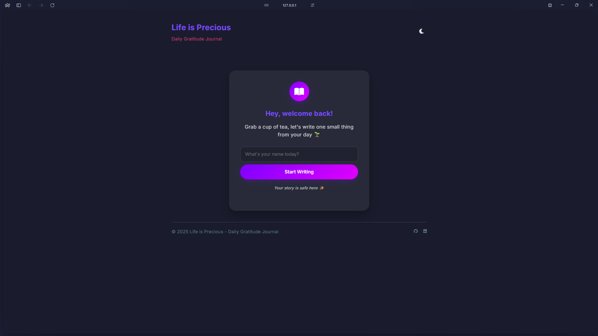
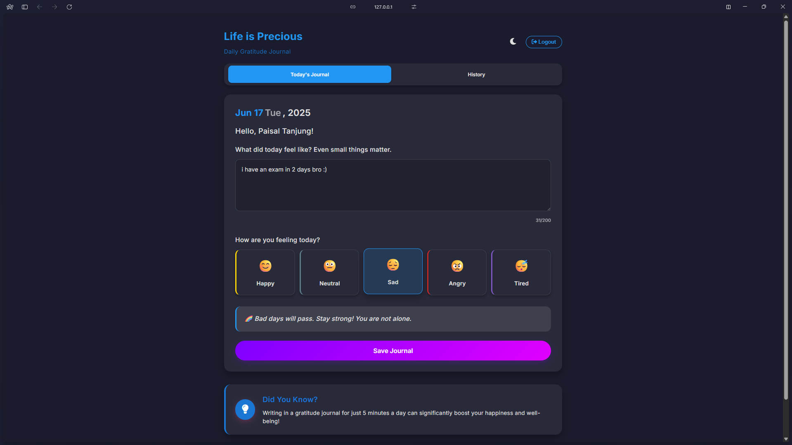
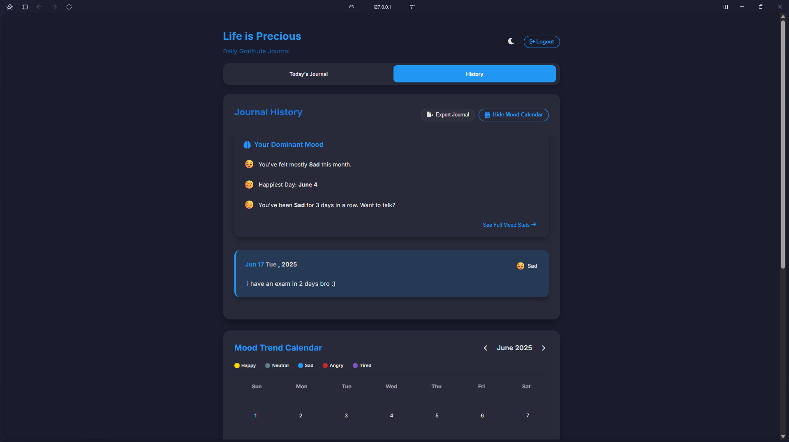
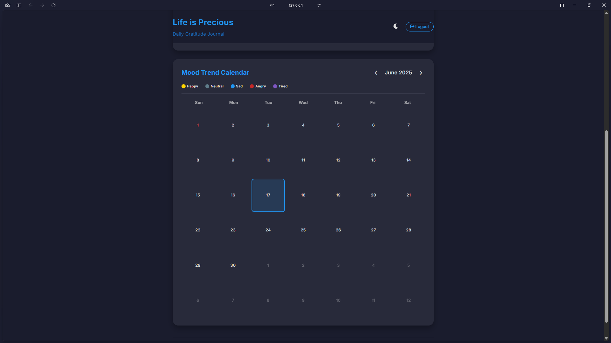
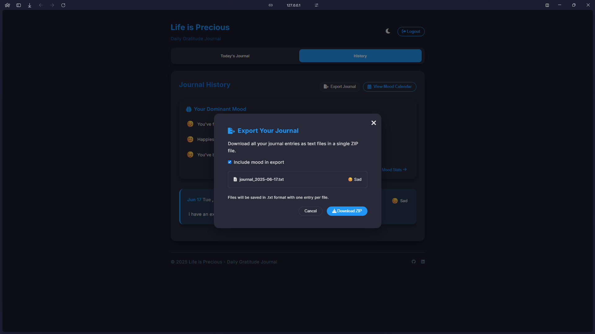
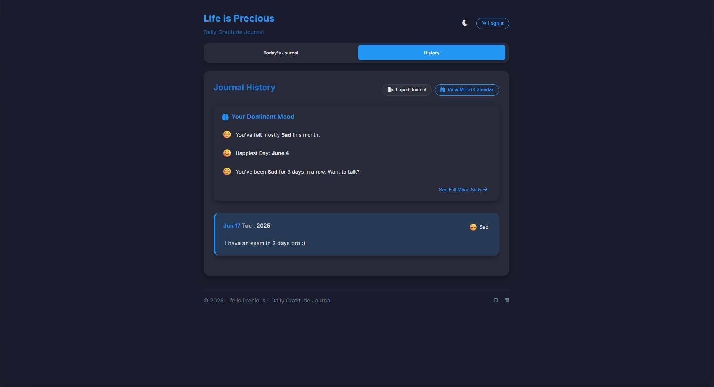

# Life is Precious — Daily Gratitude Journal

A beautiful and emotionally-aware daily gratitude journal web application that helps you reflect on your day and practice gratitude.

---

## Features

- **User-Friendly Interface**: A clean, beautiful UI designed to create a calm, safe space for daily reflection
- **Mood Tracking**: Track your mood with visual indicators (Happy, Neutral, Sad, Angry, Tired)
- **Mood-Based Themes**: UI adapts to your selected mood with colors and motivational messages
- **Journal History**: View all your past entries organized by date
- **Dark Mode**: Toggle between light and dark themes for comfortable journaling day or night
- **Local Storage**: Your entries are saved securely in your browser
- **Responsive Design**: Works on desktop, tablet, and mobile devices
- **Character Counter**: Limit entries to 200 characters to encourage concise reflection
- **Mood-Based Feedback**: Get supportive messages based on your selected mood
- **Time-Based Greetings**: Personalized greetings based on time of day
- **Confetti Animation**: Special celebration when recording happy moments
- **Export Functionality**: Download all your journal entries as text files in a single ZIP file
- **Mood Calendar View**: Visualize your mood patterns with an interactive calendar
- **Mood Analytics**: See insights about your dominant moods and patterns

---

## Screenshots

> The following screenshots show the app in action. (All images are stored in the `screenshots/` folder.)

| Welcome Screen               | Journal Entry                      | History Page                      |
| ---------------------------- | ---------------------------------- | --------------------------------- |
|  |  |  |

| Calendar View                      | Export Feature              | Mood Analytics                      |
| ---------------------------------- | --------------------------- | ----------------------------------- |
|  |  |  |

---

## How to Use

1. **Enter Your Name**: Start by entering your name on the welcome screen
2. **Write Your Entry**: Add a short note about your day (max 200 characters)
3. **Select Your Mood**: Choose the mood that best represents how you're feeling today
4. **Save Your Journal**: Click "Save Journal" to record your entry
5. **View History**: Navigate to the History tab to see all your past entries
6. **Toggle Dark Mode**: Use the sun/moon icon in the top right to switch between light and dark mode
7. **Export Your Data**: Use the Export Journal button to download your entries as a ZIP file
8. **View Mood Calendar**: Analyze your mood patterns with the calendar view
9. **Logout**: Click the logout button when you're done (your entries will remain saved)

---

## Project Philosophy

Life is Precious is built on the principle that taking a few moments each day to reflect on what we're grateful for can significantly improve our mental well-being. The application creates a safe, judgment-free space for users to acknowledge their feelings and find moments of gratitude even on difficult days.

---

## Technical Details

- Built with vanilla HTML, CSS, and JavaScript
- Uses browser's localStorage for data persistence
- Uses JSZip for export functionality
- No external dependencies or frameworks for core functionality
- Follows responsive design principles
- Implements CSS custom properties for theming
- Uses CSS animations for enhanced user experience

---

## Privacy & Data

We care deeply about your privacy.

- Your journal entries are **saved locally** in your browser
- No servers, no databases, and no trackers are used
- We **do not collect, store, or share** any personal data

You can optionally export your journals as `.txt` files — this is done **entirely in your browser**, and nothing is sent anywhere.

> You are in full control — always.

---

## License

This project is licensed under the **Apache License 2.0**. Please credit the author if you use or modify the project.

---

## Author

Made with care by Paisal Tanjung
Zero-data by design · 100% local-first experience

[GitHub](https://github.com/paisaltanjung11) | [LinkedIn](https://www.linkedin.com/in/paisaltanjung11/)
